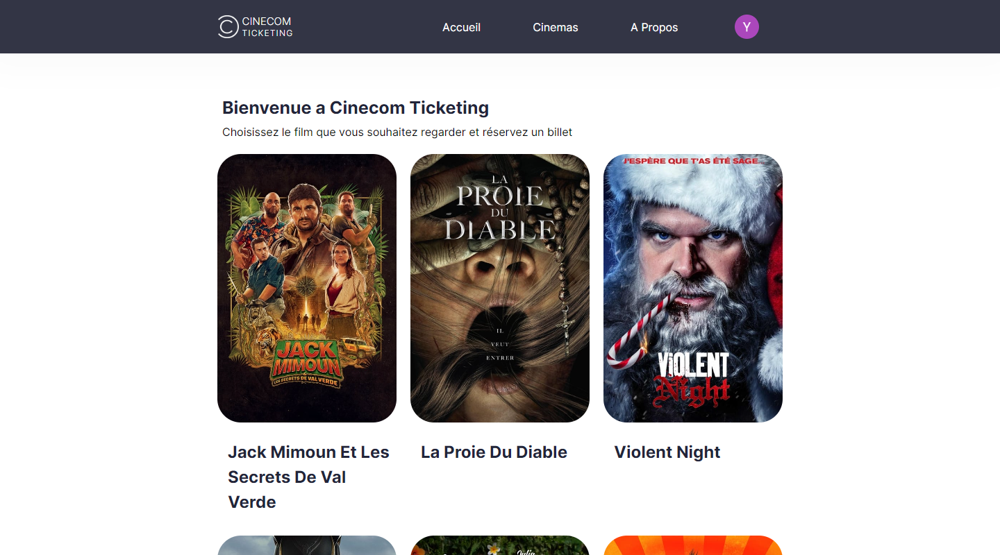

## Table of contents

- [Overview](#overview)
- [Links](#links)
- [Built with](#built-with)
- [What I Learned](#what-i-learned)

## Overview

this is a cinema ticket booking prototype that i made for a client, he wanted to test out a few ideas and
see how they look as an interactable app, the app gets the available movies lists from the [firestore database](https://firebase.google.com/docs/firestore) and then displays them as items links that takes you to a movie info page that uses [TMDB API](https://developers.themoviedb.org/3) to get the movie info, you then get can reserve the seatings and register then "pay" for the ticket, you can download the ticket(s) that contain the address and the movie QR code

### Links

- [Live Site URL](https://yacinekahlerras.github.io/cinema-ticket-booking-app/)

### Built with

- [React](https://reactjs.org/)
- [Firebase](https://firebase.google.com/)
- [TMDB API](https://developers.themoviedb.org/3)
- [Leaflet](https://react-leaflet.js.org/)
- [React Router](https://reactrouter.com/en/main)
- [Spinner](https://mhnpd.github.io/react-loader-spinner/docs/components/oval)
- [SCSS](https://sass-lang.com/)

### What I Learned

- different ways to enhance performance with memoization and finding solutions to reduce
  renders as much as possible, also used lazy loading to make the app a little less heavy
  and doesnt' download all the images at once
- familiarizing myself more with tailwind themes and configurations
- using infinite scroller to load small shunks of the big list for performance instead of doing
  pagination
- experimenting and reading more documentation about react router dom
- familiarizing myself more with firebase with its authetications and database, it is a lot easier
  to use now
